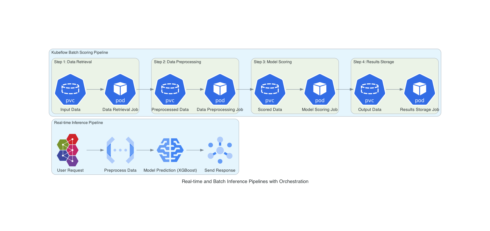

# MLOps Repository

# MLOps Pipeline Project

## Overview

### Real-Time Prediction Pipelines
The real-time prediction pipelines enable immediate responses to individual requests. They are hosted on servers, designed to handle multiple simultaneous requests, and provide insights in real-time.

### Batch Scoring Pipelines
The batch scoring pipelines are designed for large-scale data processing and analysis. Utilizing Kubeflow Pipelines and Vertex AI, they can be scheduled or triggered to handle bulk data, offering scalable and automated execution.

## Architecture
The following diagram illustrates the architecture of both the real-time prediction and batch scoring pipelines:

## How It Works

### Real-Time Prediction Pipeline
1. Receive User Request: Initiates the pipeline with incoming data.
2. Preprocess Data: Cleans and formats data for analysis.
3. Model Prediction: Utilizes a pre-trained model to generate predictions.
4. Send Response: Packages and sends predictions back to the user.

### Batch Scoring Pipeline
1. Initialization: Sets up connections and key settings.
2. Argument Parsing: Gathers specific parameters for execution.
3. Load Parameters: Loads pipeline parameters from a file.
4. Data Retrieval & Preprocessing: Prepares data for analysis.
5. Model Scoring: Analyzes data using a model.
6. Docker Containerization: Packages the pipeline for consistent execution.
7. Pipeline Compilation & Submission: Submits the pipeline for execution.
8. Run Pipeline: Executes the pipeline, handling success or errors.

## Introduction
This repository hosts an MLOps pipeline designed to automate the continuous integration, testing, building, and deployment of machine learning models. It includes a collection of scripts for managing real-time and batch models, a GitHub Actions CI/CD pipeline, and a Makefile for executing common tasks.

## Prerequisites
Before using this repository, ensure that the following tools are installed:
- Google Cloud SDK: Required for authentication and deployment to Google Cloud.
- Docker: Needed for building and running containerized applications.
- Bash: Shell scripting environment used for various automation scripts.

## CI/CD Pipeline
The GitHub Actions CI/CD pipeline is defined in the `ci-cd.yaml` file and consists of the following jobs:

### Determine Changed Modules
- Identifies the changed modules within the repository by comparing the current branch with the main branch.
- Uploads the results as an artifact for subsequent jobs.

### Test
- Authenticates with Google Cloud.
- Downloads the changed directories file from the previous job.
- Executes `make test` to run tests on the changed modules.

### Build
- Authenticates with Google Cloud and Docker.
- Downloads the changed directories file from the previous job.
- Executes `make build` to build the changed modules.

### Deploy
- Authenticates with Google Cloud and Docker.
- Downloads the changed directories file from the previous job.
- Executes `make deploy` to deploy the changed modules, only if the branch is `main` and there are no failures.

## Makefile Usage
The Makefile (`Makefile` and `default_rules.mk`) provides various targets for managing the project:

- `make test`: Placeholder for testing. Modify to include actual test commands for the main folder.
- `make build`: Placeholder for building. Modify to include actual build commands for the main folder.
- `make deploy`: Placeholder for deploying. Modify to include actual deploy commands for the main folder.
- `make create-new-model`: Prompts the user to create either a real-time or batch model, then calls the corresponding bash scripts (`create-realtime-model.sh` or `create-batch-model.sh`).
- `make clean-pycache`: Finds and deletes all Python `__pycache__` directories and `.pyc` files in the project.

## Model Creation
You can create new models using the provided scripts:

### Real-Time Model
Run `make create-new-model` and select "y" to create a new real-time model. The script `create-realtime-model.sh` will be called, copying specific templates and files to set up the model.

### Batch Model
Run `make create-new-model` and select "n" to create a new batch model. The script `create-batch-model.sh` will be called, performing similar actions for a batch model.

## Cleaning
Use the `make clean-pycache` command to clean up Python cache files throughout the project. This target finds and deletes all `__pycache__` directories and `.pyc` files.
